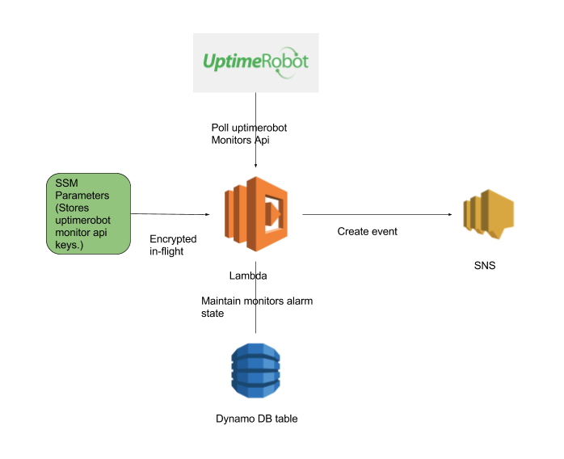

uptimerobot_alerts_to_sns

Usecase:

Publishing Uptimerobot monitor alerts to an AWS SNS topic via AWS Lambda function and Dynamo DB (to create and maintain state of alerts).
For easy integration to any service which can consume AWS SNS notifications.

High level Architecture:

This repo includes:
- Design
- AWS Lambda function.
- AWS Cloudformation stack to create all AWS services requried to execute lambda function.